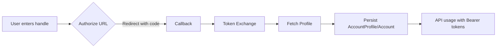

# BlueSky API Integration (AT Protocol)

Version: 1.0.0

## Overview
- Implements BlueSky authentication and social features using AT Protocol.
- Supports OAuth 2.1 with PKCE, token exchange, and secure storage.
- Exposes endpoints for profile, posts, likes, reposts, quote posts, and nested comments.
- Includes rate limiting, error handling, and performance guidance.



---

## 1. Authentication

### 1.1 OAuth Login Flow
- Start: `GET /social/bluesky/login/?handle=<handle>`
  - Parameters: `handle` (e.g., `alice.bsky.social`)
  - Server generates `state` and PKCE code challenge, redirects to `BLUESKY_AUTHORIZE_URL` with:
    - `response_type=code`
    - `client_id=<BLUESKY_CLIENT_ID_URL>`
    - `redirect_uri=<BLUESKY_REDIRECT_URL>`
    - `code_challenge=<S256>`
    - `login_hint=<handle>`
    - `state=<random>`
- Callback: `GET /social/bluesky/authorized?code=...&state=...`
  - Validates `state` and exchanges `code` at `BLUESKY_TOKEN_URL` with body:
    - `grant_type=authorization_code`, `client_id`, `redirect_uri`, `code`, `code_verifier`
  - Retrieves profile via `GET <BLUESKY_API_HOST>/xrpc/app.bsky.actor.getProfile?actor=<sub>`
  - Persists tokens and profile to `AccountProfile` and `Account`.

Code refs:
- Login: `social_app/views/bluesky.py:32`
- Authorized: `social_app/views/bluesky.py:65`

### 1.2 Tokens
- Access Token: `access_token` (Bearer), embedded with `Authorization: Bearer <token>`
- Refresh Token: `refresh_token` stored in `AccountProfile.token_secret`
- DID (subject): `sub` stored as `AccountProfile.uid` and `Account.uid`
- Expiration: `expires_in` → `expires_at`; refresh before expiry

### 1.3 Validation & Refresh
- Validate token expiration by comparing current time with `expires_at`.
- Refresh strategy: when `expires_at` is near (≤5 minutes), exchange using OAuth refresh grant (future addition); currently: re-login flow.
- Security best practices:
  - Use HTTPS for all endpoints and client metadata hosting.
  - Store tokens server-side; avoid client-side storage.
  - Use `state` and PKCE; enforce timeouts `(5, 30|60)` on HTTP calls.

---

## 2. Core API Endpoints

Base paths: `/api/social/bluesky/*`

### 2.1 Archiving Posts
- Sync: `POST /api/social/bluesky/sync/`
  - Body: `{ "uid": "did:plc:...", "start": "YYYY-MM-DD" }`
  - Effect: pulls posts via `app.bsky.feed.getAuthorFeed` and stores in `social_bluesky`.
  - Response: `{ status, success, }`
  - Code refs: `api_app/views/social/bluesky.py:29`, `social_app/views/bluesky.py:142`

- Read: `GET /api/social/bluesky/posts?uid=did:...&start=YYYY-MM-DD&end=YYYY-MM-DD&limit=50`
  - Returns stored posts with text, media, timestamps, and engagement metrics.
  - Code refs: `social_app/views/bluesky.py:235`

### 2.2 Post Likes
- List: `GET /api/social/bluesky/likes?uid=did:...&limit=50`
  - Returns liked posts with author info and like timestamp.
  - Code refs: `social_app/views/bluesky.py:263`

- Like: `POST /api/social/bluesky/like/`
  - Body: `{ "uid": "did:...", "uri": "at://...", "cid": "..." }`
  - Calls `com.atproto.repo.createRecord` with collection `app.bsky.feed.like`.
  - Response: `{ status, success, data: { uri, cid, rkey } }`
  - Code refs: `social_app/views/bluesky.py:362`

- Unlike: `POST /api/social/bluesky/unlike/`
  - Body: `{ "uid": "did:...", "rkey": "<like record key>" }`
  - Calls `com.atproto.repo.deleteRecord` on `app.bsky.feed.like`.
  - Code refs: `social_app/views/bluesky.py:383`

### 2.3 Comments (CRUD and Threads)
- Create: `POST /api/social/bluesky/comment/create/`
  - Body: `{ "uid": "did:...", "text": "...", "parent_uri": "at://...", "parent_cid": "..." }`
  - Calls `com.atproto.repo.createRecord` with `collection=app.bsky.feed.post` and `reply.parent`.
  - Code refs: `social_app/views/bluesky.py:403`

- Update: `POST /api/social/bluesky/comment/update/`
  - Body: `{ "uid": "did:...", "rkey": "<post record key>", "text": "..." }`
  - Calls `com.atproto.repo.putRecord` to overwrite text.
  - Code refs: `social_app/views/bluesky.py:426`

- Delete: `POST /api/social/bluesky/comment/delete/`
  - Body: `{ "uid": "did:...", "rkey": "<post record key>" }`
  - Calls `com.atproto.repo.deleteRecord`.
  - Code refs: `social_app/views/bluesky.py:446`

- Thread View: `GET /api/social/bluesky/comments?uid=did:...&uri=at://...`
  - Fetches nested comments up to depth 8; persists to `social_bluesky_comment` and returns ordered view.
  - Code refs: `social_app/views/bluesky.py:194`, `social_app/views/bluesky.py:302`

### 2.4 Reposts
- Standard Repost: `POST /api/social/bluesky/repost/create/`
  - Body: `{ "uid": "did:...", "uri": "at://...", "cid": "..." }`
  - Calls `com.atproto.repo.createRecord` with `collection=app.bsky.feed.repost`.
  - Code refs: `social_app/views/bluesky.py:466`

- Quote Repost: `POST /api/social/bluesky/quote/`
  - Body: `{ "uid": "did:...", "text": "...", "uri": "at://...", "cid": "..." }`
  - Creates `app.bsky.feed.post` with `embed` of the target record.
  - Code refs: `social_app/views/bluesky.py:487`

---

## 3. Client Configuration

### 3.1 client-metadata.json
- Hosted at `BLUESKY_CLIENT_ID_URL`.
- Required fields (AT Protocol OAuth profile):
  - `client_id` (URL where this JSON is served)
  - `client_name`
  - `client_uri`
  - `redirect_uris` (array of HTTPS URLs)
  - `grant_types`: `["authorization_code", "refresh_token"]`
  - `token_endpoint_auth_method`: `"none"`
  - `application_type`: `"web"`
  - `jwks` (for confidential clients; optional for public)

Example (dev):
```json
{
  "client_id": "https://localhost:8443/client-metadata.json",
  "client_name": "SharpArchive BlueSky Dev",
  "client_uri": "https://localhost:8443/",
  "redirect_uris": ["https://localhost:8443/social/bluesky/authorized"],
  "grant_types": ["authorization_code", "refresh_token"],
  "token_endpoint_auth_method": "none",
  "application_type": "web"
}
```

Example (prod):
```json
{
  "client_id": "https://app.example.com/client-metadata.json",
  "client_name": "SharpArchive BlueSky",
  "client_uri": "https://app.example.com/",
  "redirect_uris": ["https://app.example.com/social/bluesky/authorized"],
  "grant_types": ["authorization_code", "refresh_token"],
  "token_endpoint_auth_method": "none",
  "application_type": "web"
}
```

### 3.2 Validation Rules
- `client_id` must be HTTPS and publicly accessible.
- `redirect_uris` must match the callback path exactly.
- For confidential clients, publish `jwks` and rotate keys when compromised.
- Common errors: mismatched `redirect_uri`, non-HTTPS `client_id`, missing PKCE.

---

## 4. Implementation Details

### 4.1 Rate Limiting
- Per-user window counters using cache:
  - Posts/likes/reposts: 300/min
  - Comments: 200/min
- Endpoint: `GET /api/social/bluesky/rate-limits?uid=did:...`
- Code refs: `social_app/views/bluesky.py:319`

### 4.2 Error Handling
- All endpoints return `{ status, success, message|data }`.
- Use HTTP 4xx/5xx when appropriate; timeouts set for external requests.

### 4.3 Request/Response Examples
- Like:
```http
POST /api/social/bluesky/like/
Content-Type: application/json
{
  "uid": "did:plc:abc...",
  "uri": "at://did:plc:xyz/app.bsky.feed.post/3k4...",
  "cid": "bafyre..."
}
```
Response:
```json
{ "status": 200, "success": true, "data": { "uri": "at://...", "cid": "...", "rkey": "..." } }
```

- Comment Create:
```http
POST /api/social/bluesky/comment/create/
{
  "uid": "did:plc:abc...",
  "text": "Great post!",
  "parent_uri": "at://...",
  "parent_cid": "..."
}
```

- Quote Post:
```http
POST /api/social/bluesky/quote/
{
  "uid": "did:plc:abc...",
  "text": "Thoughts",
  "uri": "at://...",
  "cid": "..."
}
```

### 4.4 Performance
- Use PKCE and minimal session storage; cache profile JSON for 10 minutes.
- Batch ingestion with cursors; store to DB then serve sliced results.
- Apply timeouts `(5, 60)` and reuse `requests.Session` for heavy sync tasks.

---

## 5. Testing Requirements

### 5.1 Sample Cases
- Authentication
  - Login redirect with valid handle returns 302
  - Callback validates `state` and stores tokens
- Posts
  - Sync pulls ≥1 page and persists records
  - Filters `start/end` restrict returned set
- Likes
  - Like returns record URI/rkey
  - Unlike removes record successfully
- Comments
  - Create produces a new post with `reply.parent`
  - Update modifies text via `putRecord`
  - Delete removes record
  - Thread view returns ordered items with `depth`
- Reposts/Quote
  - Standard repost creates `app.bsky.feed.repost`
  - Quote post embeds target record

### 5.2 Expected Behavior
- Structured JSON responses with `status` and `success`.
- Rate-limit returns 429 when exceeded.
- Timeouts handled gracefully, with retry strategy for ingestion tasks.

### 5.3 Edge Cases
- Token expired: refresh or re-login; handle `401` from PDS.
- Missing `cid` on subject: reject like/repost; return `400`.
- Deleted target record: error on repost/quote; propagate message.
- Deep threads >8: truncate or paginate.

---

## Maintenance
- Documentation version in header; update on endpoint/signature changes.
- Keep `client-metadata.json` in sync with deployment URLs.
- Add changelog entries in this file or a dedicated `docs/CHANGELOG.md`.
- Review every quarter for AT Protocol spec updates.

---

## Configuration Keys
- `BLUESKY_CLIENT_ID_URL`
- `BLUESKY_AUTHORIZE_URL`
- `BLUESKY_TOKEN_URL`
- `BLUESKY_REDIRECT_URL`
- `BLUESKY_API_HOST`

---

## References
- OAuth for AT Protocol: https://docs.bsky.app/blog/oauth-atproto
- Client Implementation Guide: https://docs.bsky.app/docs/advanced-guides/oauth-client
- AT Protocol OAuth Spec: https://atproto.com/specs/oauth
