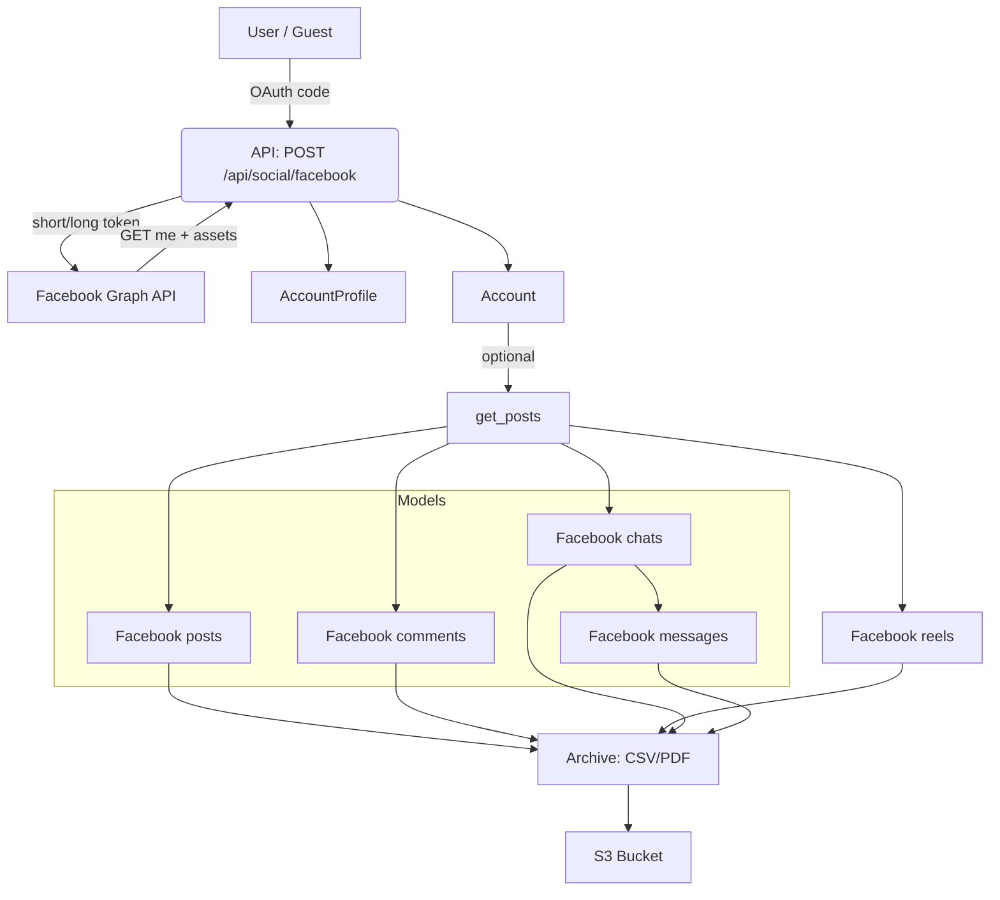
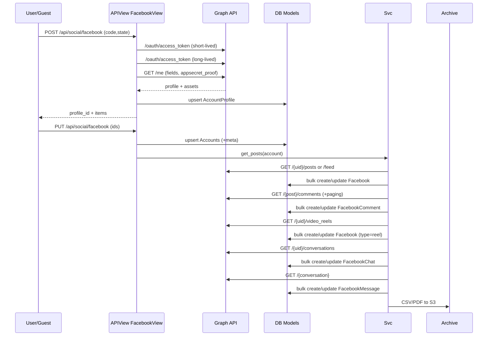
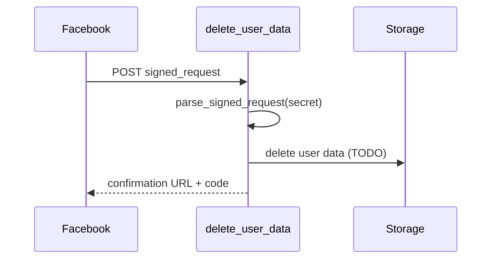

# Facebook Integration and Data Operations

This document provides a thorough analysis of Facebook-related functionality across the following files:

- `social_app/models/facebook_message.py`
- `social_app/models/facebook_comment.py`
- `social_app/models/facebook.py`
- `api_app/views/social/facebook.py`
- `social_app/views/facebook.py` (supporting functions invoked by the API view)

It covers models, API endpoints, data operations, transformation and storage, authentication, rate limiting, error handling, synchronization, diagrams, sample payloads, and configuration.

## Overview

Sharp Archive integrates with the Facebook Graph API to:

- Connect Facebook identities (Person, Page, Group) and Instagram Business accounts via Facebook login
- Fetch and archive posts, reels, comments, chats, and messages
- Persist data in relational models and export archives to CSV/PDF and S3
- Manage tokens, permissions, and error states, including user data deletion requests

---

## Models

### Facebook Post

- Model: `social_app/models/facebook.py:7`
- Table: `social_facebook` (`Meta` at `social_app/models/facebook.py:53`)
- Uniqueness: `(account_id, social_id)`
- Indexes: user, account, social, updated_at
- Fields:
  - Identity: `provider`, `social_id`, `uid`, `name`
  - Timestamps: `created_at`, `updated_at`, `archived_at`, `downloaded_at`
  - Relationships: `user`, `account`
  - Post structure: `parent_id`, `type`, `status_type`, `privacy`
  - Place: `place_name`, `place_city`, `place_country`
  - Content: `text`, `link`, `link_name`, `caption`, `description`
  - Counts: `shares_count`, `reactions_count`, `comments_count`
  - Flags: `is_published`, `is_expired`, `is_hidden`
  - Media: `full_picture`, `archived_full_picture`, `source_url`, `archived_source_url`, `attachment_url`, `attachment_images`, `archived_attachment_images`
  - URL: `facebook_url`

### Facebook Comment

- Model: `social_app/models/facebook_comment.py:8`
- Table: `social_facebook_comment` (`Meta` at `social_app/models/facebook_comment.py:47`)
- Uniqueness: `(post, social_id)`
- Indexes: user, account, post, social
- Fields:
  - Identity: `provider`, `social_id`, `parent_id`, `uid`, `name`
  - Profile: `profile_image_url`, `admin_creator`
  - Timestamps: `created_at`, `archived_at`, `downloaded_at`
  - Relationships: `user`, `account`, `post`
  - Content: `text`, `message_tags`, `type`, `title`
  - Counts and flags: `reactions_count`, `likes_count`, `comments_count`, `can_like`, `can_comment`, `can_hide`, `can_remove`, `is_hidden`, `is_private`, `user_likes`
  - Media: `source_url`, `archived_source_url`, `attachment_url`
  - URL: `facebook_url`

### Facebook Chat and Message

- Chat model: `social_app/models/facebook_message.py:7`
  - Table: `social_facebook_chat` (`Meta` at `social_app/models/facebook_message.py:26`)
  - Uniqueness: `(account_id, social_id)`
  - Identity: `social_id`, `page_id`
  - Meta: `participants`, `former_participants`, `can_reply`, `is_subscribed`, `message_count`, `unread_count`, `snippet`
  - Timestamps: `updated_at`
  - URL: `facebook_url`

- Message model: `social_app/models/facebook_message.py:37`
  - Table: `social_facebook_message` (`Meta` at `social_app/models/facebook_message.py:60`)
  - Uniqueness: `(account_id, social_id)`
  - Identity: `provider`, `social_id`, `thread_id`
  - Timestamps: `created_at`, `archived_at`, `downloaded_at`
  - Relationships: `user`, `account`, `chat`
  - Content: `text`, `tags`, `sticker`, `attachments`
  - Media archival: `archived_sticker`, `archived_attachments`
  - Participants: `from_uid`, `to_uids`

---

## API Views (Business Logic)

File: `api_app/views/social/facebook.py`

### Endpoints

- `POST /api/social/facebook/` → `FacebookView.post` (`api_app/views/social/facebook.py:33`)
  - Purpose: Exchange authorization code for access token; read `me` profile and connected assets; present items that can be connected; upsert `AccountProfile`.

- `PUT /api/social/facebook/` → `FacebookView.put` (`api_app/views/social/facebook.py:190`)
  - Purpose: Create or update `Account` rows for selected items; set `exclude_direct_message` meta for pages; send notifications and email; optionally trigger downstream ingestion (commented inline).

- `POST /facebook/delete-user-data/` → `delete_user_data` (`api_app/views/social/facebook.py:389`)
  - Purpose: Handle Facebook user data deletion callback. Verifies `signed_request` via `parse_signed_request` and returns confirmation payload.

- `GET /facebook/data-deletion-status/` → `data_deletion_status` (`api_app/views/social/facebook.py:442`)
  - Purpose: Return deletion status page view.

### Flow: `POST /api/social/facebook/`

1. Validate environment and `code` (`api_app/views/social/facebook.py:34-74`).
2. Resolve user via `state` Guest token or authenticated owner (`api_app/views/social/facebook.py:46-64`).
3. Exchange short-lived token (`get_short_live_access_token`) and long-lived token (`get_long_live_access_token`), compute `expires_at` via Graph `debug_token` if necessary (`api_app/views/social/facebook.py:76-91`).
4. Call `GET /{VERSION}/me` with `fields`, `appsecret_proof` (`api_app/views/social/facebook.py:93-103`).
5. Upsert `AccountProfile` with `extra_data` and tokens (`api_app/views/social/facebook.py:105-107`).
6. Build selectable `items`: Person, Instagram Business, Pages, Groups (`api_app/views/social/facebook.py:118-155`).
7. Mark each item as already added or not based on existing `Account` rows and meta (`api_app/views/social/facebook.py:156-178`).
8. Return `profile_id` and `items` (`api_app/views/social/facebook.py:180-184`).

### Flow: `PUT /api/social/facebook/`

1. Validate environment and resolve user (Guest or authenticated owner) (`api_app/views/social/facebook.py:191-214`).
2. Inputs: `profile_id`, `ids[]`, `excludeDirectMessageIds` (`api_app/views/social/facebook.py:216-219`).
3. Load `AccountProfile` to retrieve `access_token`, `expires_at`, `last_login`, and `extra_data` (`api_app/views/social/facebook.py:220-225`).
4. Build `data` list for selected Person, Instagram Business, Pages, and Groups with tokens and labels (`api_app/views/social/facebook.py:227-293`).
5. For each item:
   - Download `profile_image_url` and upsert/update `Account` (`api_app/views/social/facebook.py:295-325`).
   - Manage `exclude_direct_message` meta for pages (`api_app/views/social/facebook.py:326-339`).
   - Create `AccountHistory` and notifications/emails for new connections (`api_app/views/social/facebook.py:340-381`).
6. Return success JSON with `provider` and a `social_label` summary (`api_app/views/social/facebook.py:358-383`, `api_app/views/social/facebook.py:342-346`).

### User Data Deletion

- Validates and decodes `signed_request` (`parse_signed_request`, `api_app/views/social/facebook.py:422-439`).
- Returns confirmation data with a `data-deletion-status` URL (`api_app/views/social/facebook.py:412-419`).

---

## Core Facebook Integration

File: `social_app/views/facebook.py`

Key functions (called by API view or jobs):

- OAuth token exchange:
  - `get_short_live_access_token` (`social_app/views/facebook.py:348`)
  - `get_long_live_access_token` (`social_app/views/facebook.py:360`)
  - `get_never_expire_page_tokens` (`social_app/views/facebook.py:375`)
  - `compute_appsecret_proof` (`social_app/views/facebook.py:385`)

- Data ingestion:
  - Posts: `get_posts` (`social_app/views/facebook.py:394`)
  - Reels: `get_reels` (`social_app/views/facebook.py:571`)
  - Comments (with nested replies): `get_comments` (`social_app/views/facebook.py:644`)
  - Chats and messages: `get_chats` (`social_app/views/facebook.py:744`), `get_messages` (`social_app/views/facebook.py:910`)

- Data transformation:
  - Posts: `pre_precess_post` (`social_app/views/facebook.py:1028`)
  - Comments: `pre_precess_comment` (`social_app/views/facebook.py:1141`)
  - Messages: `pre_process_message` (`social_app/views/facebook.py:1207`)

- Archival/export:
  - `archive` (`social_app/views/facebook.py:1242`) → CSV/PDF + S3
  - `export` (`social_app/views/facebook.py:1839`) → Zip of CSV/PDF + media

- Profile maintenance:
  - `update_profile_image` (`social_app/views/facebook.py:2134`)
  - `refresh` (`social_app/views/facebook.py:2292`) → renew tokens and refresh assets

---

## Facebook Data Operations

### Data Fetched

- Identity data: `me` fields: `id`, `name`, `email or short_name`, `picture` (`api_app/views/social/facebook.py:93-104`)
- Connected assets: Instagram Business, Pages, Groups (`api_app/views/social/facebook.py:118-155`)
- Posts: feed/posts depending on `account.type` (`social_app/views/facebook.py:394-419`)
- Reels: `video_reels` (`social_app/views/facebook.py:571-585`)
- Comments: top-level and nested comments (`social_app/views/facebook.py:644-715`)
- Chats: conversations (`social_app/views/facebook.py:744-777`)
- Messages: per conversation (`social_app/views/facebook.py:846-905`, `social_app/views/facebook.py:910-1025`)

### Exact Graph API Endpoints and Parameters

- OAuth token exchange:
  - `GET https://graph.facebook.com/{VERSION}/oauth/access_token` with params
    - short-lived: `client_id`, `client_secret`, `code`, `grant_type=authorization_code`, `redirect_uri` (`social_app/views/facebook.py:348-357`)
    - long-lived: `client_id`, `client_secret`, `grant_type=fb_exchange_token`, `fb_exchange_token` (`social_app/views/facebook.py:360-371`)

- Token debug:
  - `GET https://graph.facebook.com/debug_token?input_token={access_token}&access_token={APP_ID}|{APP_SECRET}` (`api_app/views/social/facebook.py:83-88`)

- Profile (`me`):
  - `GET https://graph.facebook.com/{VERSION}/me` with params `fields=...`, `access_token`, `appsecret_proof` (`api_app/views/social/facebook.py:93-99`)

- Accounts and assets:
  - `GET https://graph.facebook.com/{VERSION}/me/accounts?access_token={long_live_access_token}` (`social_app/views/facebook.py:375-382`)

- Posts/feed:
  - For `Group`: `GET /{uid}/feed?{fields, limit, access_token}` (`social_app/views/facebook.py:415-417`)
  - For `Person`/`Page`: `GET /{uid}/posts?{fields, limit, access_token}` (`social_app/views/facebook.py:418-419`)

- Reels:
  - `GET /{uid}/video_reels?{fields, limit, access_token}` (`social_app/views/facebook.py:583`)

- Comments:
  - `GET /{post_social_id}/comments?{fields, limit, access_token}` (`social_app/views/facebook.py:655`)
  - Nested comment paging via `paging.next` (`social_app/views/facebook.py:686-709`)

- Chats:
  - `GET /{page_uid}/conversations?{fields, limit, access_token}` (`social_app/views/facebook.py:756`)

- Single conversation & messages:
  - `GET /{conversation_id}?{fields, access_token}` (`social_app/views/facebook.py:917`)

### Data Transformation and Storage

- Post normalization: `pre_precess_post` maps Graph fields to `Facebook` model; computes counts and media URLs; flattens attachments, subattachments, and event metadata; sets `facebook_url` (`social_app/views/facebook.py:1028-1138`).
- Comment normalization: `pre_precess_comment` maps Graph fields, parent id, reaction/like counts, attachment info, and permalink (`social_app/views/facebook.py:1141-1204`).
- Message normalization: `pre_process_message` formats recipients, text, tags, sticker, and attachments to JSON (`social_app/views/facebook.py:1207-1239`).
- Persistence:
  - Bulk create/update for posts, comments, chats, and messages (`social_app/views/facebook.py:544-547`, `social_app/views/facebook.py:733-737`, `social_app/views/facebook.py:842-845`, `social_app/views/facebook.py:902-905`).
  - Media archiving to local storage/S3 during `archive` and `export` (`social_app/views/facebook.py:1284-1333`, `social_app/views/facebook.py:1481-1679`, `social_app/views/facebook.py:1874-2014`).

### Posting Mechanisms and Payloads

- The codebase does not implement creating Facebook posts or sending direct messages to Facebook. All operations are read/ingest/archive only.
- No Graph API `POST` calls are present for publishing content.

---

## Implementation Details

### Authentication Flow and Token Management

- Web login endpoints (`social_app/views/facebook.py:42-50`, `social_app/views/facebook.py:52-181`): build Facebook OAuth URL with `state`, handle callback `authorized`, exchange tokens, load profile via `me`, and render selectable assets.
- API login (`api_app/views/social/facebook.py:33-185`): same token exchange via helper functions; stores in `AccountProfile` and returns JSON.
- Token handling:
  - Use app-id/app-secret and version from settings to exchange tokens.
  - Long-lived tokens (~60 days) via `fb_exchange_token`.
  - `appsecret_proof` computed for Graph calls (`social_app/views/facebook.py:385-391`).
  - For pages, `expires_at` is unset (`None`) as page tokens are non-expiring (`api_app/views/social/facebook.py:322`).

### Rate Limiting and Error Handling

- Adaptive page size on rate-limit-like error: reduce `limit` when error message says “Please reduce the amount of data…” (`social_app/views/facebook.py:430-433`, `social_app/views/facebook.py:667-670`).
- Error states:
  - Detect invalid tokens and inaccessible pages; persist `Account.status`, notify user, and email templates based on error type (`social_app/views/facebook.py:435-474`).
  - Log critical errors via `save_history` throughout ingestion (`social_app/views/facebook.py:568`, `social_app/views/facebook.py:641`, `social_app/views/facebook.py:741`, `social_app/views/facebook.py:907`, etc.).
  - Handle connection errors in comments (`social_app/views/facebook.py:738-741`).

### Data Synchronization Frequency and Triggers

- Explicit triggers in code:
  - After connecting accounts, optional ingestion calls are present but commented (`api_app/views/social/facebook.py:353-356`).
  - `get_posts` orchestrates posts → comments → reels → chats → archive (`social_app/views/facebook.py:544-566`).
  - `refresh` updates `AccountProfile` tokens and synchronizes accounts (`social_app/views/facebook.py:2292-2400`).
  - `update_profile_image` refreshes profile images for accounts (`social_app/views/facebook.py:2134-2206`, `social_app/views/facebook.py:2208-2290`).
- External scheduling is not shown here; these functions are suitable for periodic jobs.

---

## Diagrams

### Architecture Diagram



### Sequence: Connect and Ingest



### Sequence: Data Deletion



---

## Sample Payloads

### POST `/api/social/facebook/`

Request body:

```json
{
  "code": "AQB...",
  "state": "guest-token-uuid"
}
```

Response body:

```json
{
  "status": 200,
  "success": true,
  "data": {
    "profile_id": "1234567890",
    "items": [
      {"id":"1234567890","name":"John Doe","username":"john@example.com","picture":"https://...","type":"Person","added":false},
      {"id":"987654321","name":"My Page","username":"EAAG...","picture":"https://...","type":"Page","added":true}
    ]
  }
}
```

### PUT `/api/social/facebook/`

Request body:

```json
{
  "profile_id": "1234567890",
  "ids": ["1234567890", "987654321"],
  "excludeDirectMessageIds": ["987654321"]
}
```

Response body:

```json
{
  "status": 200,
  "success": true,
  "message": "Feed Connected",
  "provider": "Facebook",
  "social_label": "2 Accounts: john@example.com, EAAG..."
}
```

### Graph: GET `/me`

Example fields param (`SOCIAL_FACEBOOK_FIELDS`): `id,email,name,short_name,picture,accounts{...},groups{...}`. Response contains `id`, `name`, `email/short_name`, `picture.data.url`, nested `accounts.data`, `groups.data`.

### Graph: GET `/{uid}/posts` and `/{uid}/feed`

Fields include:

```text
id,from,created_time,updated_time,parent_id,type/status_type,place,message,link,name,caption,description,privacy,
shares,reactions.limit(0).summary(true),comments.limit(0).summary(true),is_published,is_expired,is_hidden,full_picture,source/permalink_url,
attachments{description,description_tags,media_type,media,subattachments,target,title,type,url,unshimmed_url}
```

### Graph: GET `/{post_id}/comments`

Fields include reaction/like/comment counts, permissions, attachment, permalink; supports nested comment pagination.

### Graph: GET `/{uid}/conversations` and `/{conversation_id}`

Chat fields: participants, former participants, can_reply, is_subscribed, message_count, unread_count, updated_time, snippet, link; messages include `id`, `thread_id`, `created_time`, `from`, `to`, `message`, `tags`, `attachments`, `sticker`, `shares`.

### POST `/facebook/delete-user-data/`

Request body (form): `signed_request={...}`

Response body:

```json
{
  "url": "https://<host>/api/facebook/data-deletion-status/",
  "confirmation_code": "<user_id>_<timestamp>"
}
```

---

## Configuration

- `my_settings` values consumed by Facebook integration (`api_app/views/social/facebook.py:17`, `social_app/views/facebook.py:24-26`):
  - `SOCIAL_FACEBOOK_KEY`, `SOCIAL_FACEBOOK_SECRET`, `SOCIAL_FACEBOOK_SCOPE`, `SOCIAL_FACEBOOK_FIELDS`, `SOCIAL_FACEBOOK_VERSION`, `SOCIAL_FACEBOOK_REDIRECT`
  - `SHARP_ARCHIVE_URL`, `ARCHIVE_API_URL`
  - AWS: `AWS_ACCESS_KEY_ID`, `AWS_SECRET_ACCESS_KEY`, `AWS_STORAGE_BUCKET_NAME`
  - Email: `GMAIL_HOST_USER`, `ADMIN_RECIPIENT_ADDRESS`, `LOG_RECIPIENT_ADDRESS`
  - `ENVIRONMENT`

- `wkhtmltopdf` binary path: `/usr/local/bin/wkhtmltopdf` or Windows path `C:\Program Files\wkhtmltopdf\bin\wkhtmltopdf.exe` (`social_app/views/facebook.py:1448-1452`, `social_app/views/facebook.py:1728-1732`).

- Storage paths: Local archive directories under `settings.ARCHIVE_DIR` and S3 prefix `"{ENVIRONMENT}/archive_data/{user_id}/Facebook/{account_id}/{YEAR}/"` (`social_app/views/facebook.py:1284-1287`).

---

## Notes and Observations

- `get_posts` orchestrates a full pipeline for a Facebook account: posts → events enrichment → comments (page only) → reels → chats (page only, unless excluded) → archive.
- For nested comments, parent linkage is synthesized when missing to maintain relational integrity (`social_app/views/facebook.py:689-713`).
- Media archiving intelligently avoids redownloading by checking stored paths and downloading only missing assets.
- Posting/sending functionality is not implemented; this system focuses on ingestion and archiving.

---

## References

- `api_app/views/social/facebook.py:29-184` — APIView `FacebookView` with `post`
- `api_app/views/social/facebook.py:190-383` — APIView `FacebookView` with `put`
- `api_app/views/social/facebook.py:389-419` — `delete_user_data`
- `api_app/views/social/facebook.py:422-441` — `parse_signed_request`
- `social_app/views/facebook.py:348-371` — token exchange helpers
- `social_app/views/facebook.py:394-566` — posts ingestion and orchestration
- `social_app/views/facebook.py:571-640` — reels ingestion
- `social_app/views/facebook.py:644-741` — comments ingestion
- `social_app/views/facebook.py:744-907` — chats and messages ingestion
- `social_app/views/facebook.py:1242-1681` — archiving
- `social_app/models/facebook.py:7-61` — posts model
- `social_app/models/facebook_comment.py:8-55` — comments model
- `social_app/models/facebook_message.py:7-36,37-69` — chat and message models
